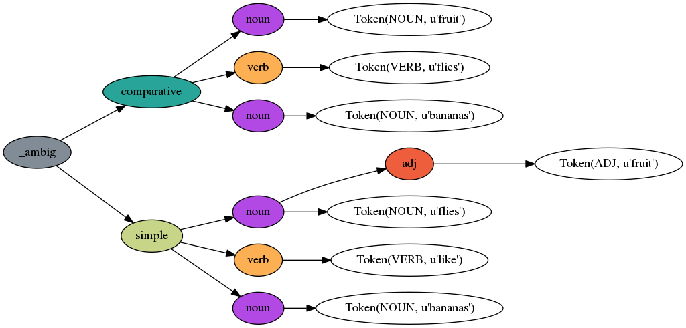
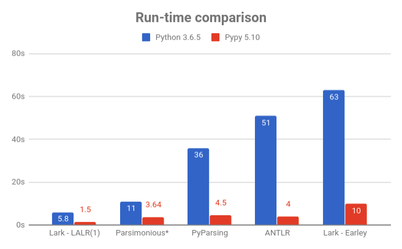
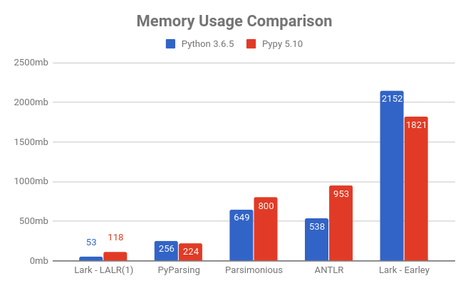

# Lark - a parsing toolkit for Python

Lark is a parsing toolkit for Python, built with a focus on ergonomics, performance and modularity.

Lark can parse all context-free languages. To put it simply, it means that it is capable of parsing almost any programming language out there, and to some degree most natural languages too.

**Who is it for?**

   - **Beginners**: Lark is very friendly for experimentation. It can parse any grammar you throw at it, no matter how complicated or ambiguous, and do so efficiently. It also constructs an annotated parse-tree for you, using only the grammar and an input, and it gives you convienient and flexible tools to process that parse-tree.

   - **Experts**: Lark implements both Earley(SPPF) and LALR(1), and several different lexers, so you can trade-off power and speed, according to your requirements. It also provides a variety of sophisticated features and utilities.

**What can it do?**

 - Parse all context-free grammars, and handle any ambiguity gracefully
 - Build an annotated parse-tree automagically, no construction code required.
 - Provide first-rate performance in terms of both Big-O complexity and measured run-time (considering that this is Python ;)
 - Run on every Python interpreter (it's pure-python)
 - Generate a stand-alone parser (for LALR(1) grammars)

And many more features. Read ahead and find out!

Most importantly, Lark will save you time and prevent you from getting parsing headaches.

### Quick links

- [Documentation @readthedocs](https://lark-parser.readthedocs.io/)
- [Cheatsheet (PDF)](/docs/_static/lark_cheatsheet.pdf)
- [Online IDE (very basic)](https://lark-parser.github.io/lark/ide/app.html)
- [Tutorial](/docs/json_tutorial.md) for writing a JSON parser.
- Blog post: [How to write a DSL with Lark](http://blog.erezsh.com/how-to-write-a-dsl-in-python-with-lark/)
- [Gitter chat](https://gitter.im/lark-parser/Lobby)

### Install Lark

    $ pip install lark-parser --upgrade

Lark has no dependencies.

[](https://travis-ci.org/lark-parser/lark)

### Syntax Highlighting

Lark provides syntax highlighting for its grammar files (\*.lark):

- [Sublime Text & TextMate](https://github.com/lark-parser/lark_syntax)
- [vscode](https://github.com/lark-parser/vscode-lark)
- [Intellij & PyCharm](https://github.com/lark-parser/intellij-syntax-highlighting)
- [Vim](https://github.com/lark-parser/vim-lark-syntax)
- [Atom](https://github.com/Alhadis/language-grammars)

### Clones

- [Lerche (Julia)](https://github.com/jamesrhester/Lerche.jl) - an unofficial clone, written entirely in Julia.

### Hello World

Here is a little program to parse "Hello, World!" (Or any other similar phrase):

```python
from lark import Lark

l = Lark('''start: WORD "," WORD "!"

            %import common.WORD   // imports from terminal library
            %ignore " "           // Disregard spaces in text
         ''')

print( l.parse("Hello, World!") )
```

And the output is:

```python
Tree(start, [Token(WORD, 'Hello'), Token(WORD, 'World')])
```

Notice punctuation doesn't appear in the resulting tree. It's automatically filtered away by Lark.

### Fruit flies like bananas

Lark is great at handling ambiguity. Here is the result of parsing the phrase "fruit flies like bananas":



[Read the code here](https://github.com/lark-parser/lark/tree/master/examples/fruitflies.py), and see [more examples here](https://lark-parser.readthedocs.io/en/latest/examples/index.html).


## List of main features

 - Builds a parse-tree (AST) automagically, based on the structure of the grammar
 - **Earley** parser
    - Can parse all context-free grammars
    - Full support for ambiguous grammars
 - **LALR(1)** parser
    - Fast and light, competitive with PLY
    - Can generate a stand-alone parser
 - **CYK** parser, for highly ambiguous grammars
 - **EBNF** grammar
 - **Unicode** fully supported
 - **Python 2 & 3** compatible
 - Automatic line & column tracking
 - Standard library of terminals (strings, numbers, names, etc.)
 - Import grammars from Nearley.js ([read more](/docs/nearley.md))
 - Extensive test suite [](https://codecov.io/gh/erezsh/lark)
 - MyPy support using type stubs
 - And much more!

See the full list of [features here](https://lark-parser.readthedocs.io/en/latest/features.html)


### Comparison to other libraries

#### Performance comparison

Lark is the fastest and lightest (lower is better)






Check out the [JSON tutorial](/docs/json_tutorial.md#conclusion) for more details on how the comparison was made.

*Note: I really wanted to add PLY to the benchmark, but I couldn't find a working JSON parser anywhere written in PLY. If anyone can point me to one that actually works, I would be happy to add it!*

*Note 2: The parsimonious code has been optimized for this specific test, unlike the other benchmarks (Lark included). Its "real-world" performance may not be as good.*

#### Feature comparison

| Library | Algorithm | Grammar | Builds tree? | Supports ambiguity? | Can handle every CFG? | Line/Column tracking | Generates Stand-alone
|:--------|:----------|:----|:--------|:------------|:------------|:----------|:----------
| **Lark** | Earley/LALR(1) | EBNF | Yes! | Yes! | Yes! | Yes! | Yes! (LALR only) |
| [PLY](http://www.dabeaz.com/ply/) | LALR(1) | BNF | No | No | No | No | No |
| [PyParsing](https://github.com/pyparsing/pyparsing) | PEG | Combinators | No | No | No\* | No | No |
| [Parsley](https://pypi.python.org/pypi/Parsley) | PEG | EBNF | No | No | No\* | No | No |
| [Parsimonious](https://github.com/erikrose/parsimonious) | PEG | EBNF | Yes | No | No\* | No | No |
| [ANTLR](https://github.com/antlr/antlr4) | LL(*) | EBNF | Yes | No | Yes? | Yes | No |


(\* *PEGs cannot handle non-deterministic grammars. Also, according to Wikipedia, it remains unanswered whether PEGs can really parse all deterministic CFGs*)


### Projects using Lark

 - [tartiflette](https://github.com/dailymotion/tartiflette) - a GraphQL server by Dailymotion
 - [Hypothesis](https://github.com/HypothesisWorks/hypothesis) - Library for property-based testing
 - [mappyfile](https://github.com/geographika/mappyfile) - a MapFile parser for working with MapServer configuration
 - [synapse](https://github.com/vertexproject/synapse) - an intelligence analysis platform
 - [Datacube-core](https://github.com/opendatacube/datacube-core) - Open Data Cube analyses continental scale Earth Observation data through time
 - [SPFlow](https://github.com/SPFlow/SPFlow) - Library for Sum-Product Networks
 - [Torchani](https://github.com/aiqm/torchani) - Accurate Neural Network Potential on PyTorch
 - [Command-Block-Assembly](https://github.com/simon816/Command-Block-Assembly) - An assembly language, and C compiler, for Minecraft commands
 - [EQL](https://github.com/endgameinc/eql) - Event Query Language
 - [Fabric-SDK-Py](https://github.com/hyperledger/fabric-sdk-py) - Hyperledger fabric SDK with Python 3.x
 - [required](https://github.com/shezadkhan137/required) - multi-field validation using docstrings
 - [miniwdl](https://github.com/chanzuckerberg/miniwdl) - A static analysis toolkit for the Workflow Description Language
 - [pytreeview](https://gitlab.com/parmenti/pytreeview) - a lightweight tree-based grammar explorer
 - [harmalysis](https://github.com/napulen/harmalysis) - A language for harmonic analysis and music theory
 - [gersemi](https://github.com/BlankSpruce/gersemi) - A CMake code formatter

Using Lark? Send me a message and I'll add your project!

## License

Lark uses the [MIT license](LICENSE).

(The standalone tool is under MPL2)

## Contribute

Lark is currently accepting pull-requests. See [How to develop Lark](/docs/how_to_develop.md)

## Sponsor

If you like Lark, and want to see it grow, please consider [sponsoring us!](https://github.com/sponsors/lark-parser)

## Contact the author

Questions about code are best asked on [gitter](https://gitter.im/lark-parser/Lobby) or in the issues.

For anything else, I can be reached by email at erezshin at gmail com.

 -- [Erez](https://github.com/erezsh)
